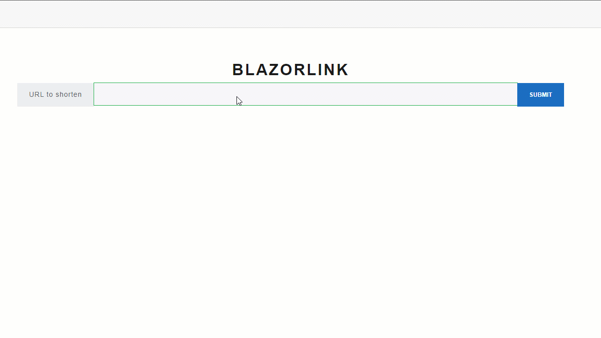

# BlazorLink
A url shortner built using .net 7, API and Blazor webassembly for UI 

Like bitly but written in wasm

Currently the project is just using an in memory database using entity framework core, you can easily swap this out for a different database type. 

Adding `+` to the end of a shortend link revels its destination, Just like bitly does.

